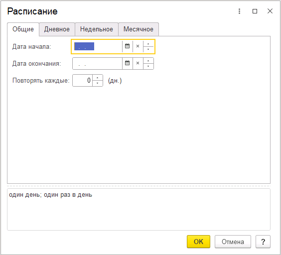
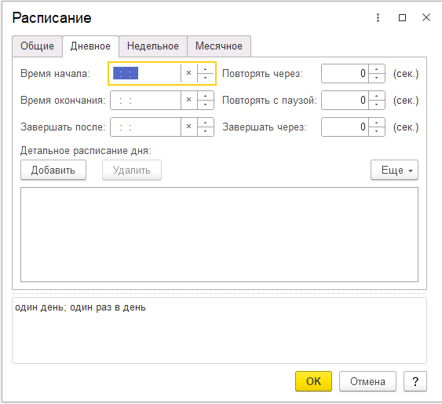
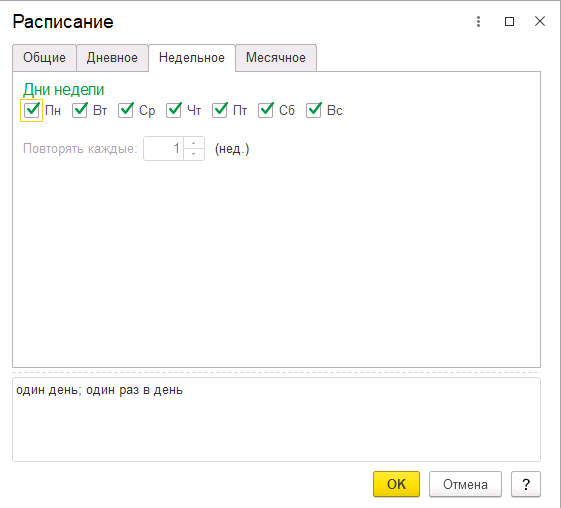
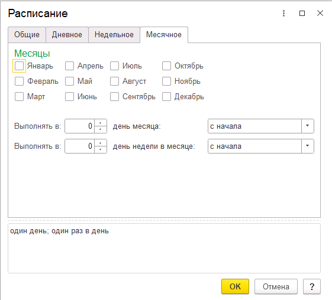
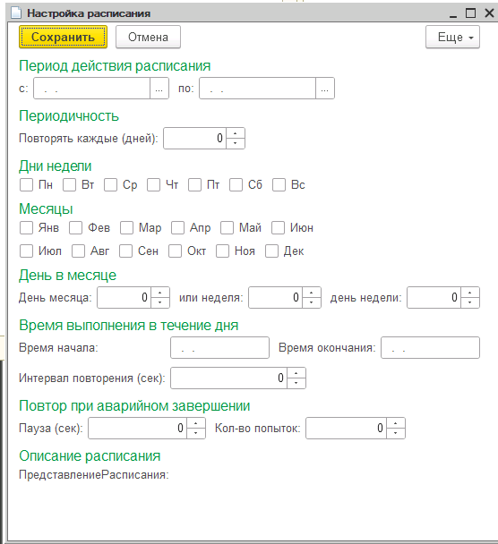
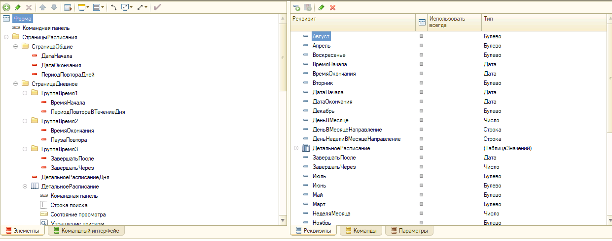
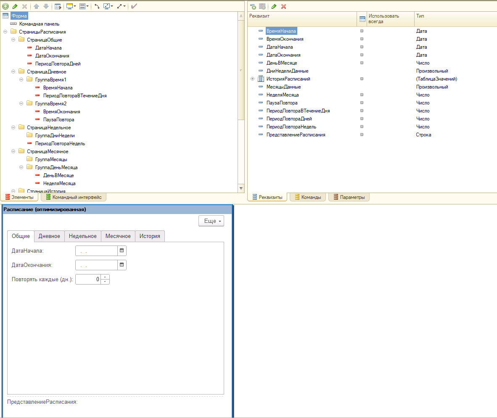

# Итоги тестирования AI-ассистента для разработки 1С

> **TL;DR**
> | Задача | Результат |
> |--------|-----------|
> | XML-форма по описанию | ✅ Загружена в конфигуратор за 3 итерации |
> | Рефакторинг 1500+ строк | ✅ Legacy → Enterprise за один сеанс |
> | ТЗ → Конфигурация | ✅ От PDF до загружаемых метаданных |

## Обзор

Проведено тестирование возможностей AI-ассистента на трёх практических задачах разработки для платформы 1С:Предприятие.

**Используемые инструменты:**

| Компонент | Значение |
|-----------|----------|
| Клиент-агент | Gemini CLI (Google DeepMind) |
| Модель | Gemini 2.5 Pro, Claude Opus |
| Режим | Agentic mode с доступом к файловой системе |

---

## Тест 1. Генерация XML-формы

> 🎯 **Результат:** Полностью рабочая XML-форма за 3 итерации — от текстового описания до загрузки в конфигуратор

**Задача:** Создать кастомный аналог платформенной формы `ДиалогРасписанияРегламентногоЗадания.Показать()`

**Процесс:**

1. Передан пример навороченной формы для изучения структуры XML (группы, вкладки, таблицы)
2. Запрошена генерация по простому промту
   - *Трудности:* изначально была отправлена простая форма — возникли проблемы с загрузкой в конфигуратор
3. Отправлены скриншоты целевой формы — исправлена раскладка и добавлены недостающие элементы
4. Запрошена оптимизация — дни недели и месяцы генерируются динамически в коде

### Исходные скриншоты формы

| | |
|:---:|:---:|
|  |  |
|  |  |

### Результаты генерации

| Первая генерация | После отправки скриншотов | Финальный результат (оптимизация) |
|:---:|:---:|:---:|
|  |  |  |

**Результат:** ✅ Форма успешно загружена в конфигуратор

**Выводы:**

- Важно предоставлять примеры сложных форм, а не простые шаблоны
- Скриншоты помогают быстро корректировать UI

---

## Тест 2. Рефакторинг модуля

> 🔧 **Результат:** Legacy-код на 1500+ строк приведён к стандартам Enterprise за один сеанс

**Задача:** Оптимизация общего модуля на 1500+ строк согласно стандартам ИТС и Phoenix BSL

**Состав модуля:**

- Интеграции с SharePoint
- Рассылки
- Взаимодействие с файловой системой
- Несколько процедур в черновом варианте (дублирование кода, высокая цикломатическая сложность, ошибки оформления)

**Что исправлено:**

| Категория | Подробности | Статус |
|-----------|-------------|--------|
| Оформление кода | Единообразные отступы, именование переменных по стандарту 1С | ✅ |
| Устранение дублирования | Выделены общие функции для повторяющегося кода | ✅ |
| Транзакции | Попытка/Исключение вокруг блоков записи, корректный откат | ✅ |
| Документация | Комментарии к функциям, описание параметров и возврата | ✅ |
| Логирование | Вставил логирование в нужных местах (места понравились!) | ✅ |
| HTTP-интеграции | Анализ кодов состояния методов интеграций | ✅ |
| Декомпозиция | 50/50 — требуется более серьёзный контроль, вопрос промтов и инструкций | ⚠️ Частично |

**Вывод:** Модуль работает без синтаксических и логических ошибок. Код переведён из состояния "Legacy" в "Enterprise Supportable"

> 📝 Есть файл с подробным описанием, который модель сама сгенерировала по просьбе

---

## Тест 3. Полный цикл разработки

> 🚀 **Результат:** От PDF-техзадания до загружаемой конфигурации с полным набором метаданных

**Задача:** От анализа ТЗ до готовой структуры конфигурации-расширения

**Этапы:**

1. ✅ Загружена шаблонная конфигурация
2. ✅ Изучены и зафиксированы подходы
3. ✅ Созданы файлы пустой конфигурации
4. ✅ Проанализировано сырое ТЗ (PDF)
5. ✅ Конвертация ТЗ в Markdown
6. ✅ Сформирован план разработки
7. ✅ Добавлены объекты метаданных
8. ✅ Результат загружен в конфигуратор 1С

**Созданные артефакты:**

- План разработки с чек-листом задач
- Технический и пользовательский логи
- Рекомендуемые промты для дальнейшей работы

---

## Накапливаемый опыт

По итогам каждого теста были созданы **инструкции и шаблоны**, которые:

- 📉 **Сокращают контекст и потребление токенов** — не нужно каждый раз объяснять структуру XML или стандарты оформления
- ⚡ **Уменьшают количество итераций** — меньше ошибок, быстрее результат
- 🎯 **Повышают точность** — модель сразу знает ожидаемый формат и требования

**Созданные инструкции:**

| Тест | Инструкция | Назначение |
|------|------------|------------|
| Генерация форм | Шаблоны XML-форм, примеры структур | Сразу получать корректный XML |
| Рефакторинг | Чек-лист проверок, стандарты Phoenix BSL | Единообразный код без итераций |
| Полный цикл | Промты для разработки, шаблон конфигурации | Быстрый старт новых проектов |

> 💡 **Идея:** При повторных задачах подключаем эти инструкции — модель работает быстрее, дешевле и точнее

---

## Общие выводы

1. **Генерация форм** — работает при наличии качественных примеров
2. **Рефакторинг** — справляется с оформлением и базовыми улучшениями; декомпозиция требует более детальных промтов
3. **Полный цикл** — способен вести проект от ТЗ до загружаемой конфигурации

---

## Материалы

Все изображения находятся в папке [`images/`](images/).
